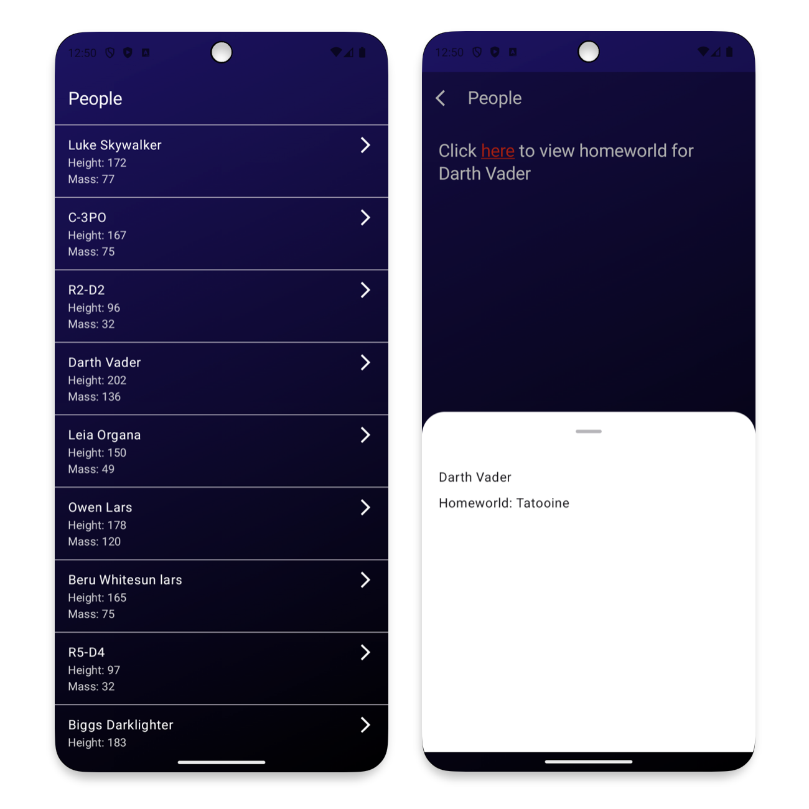

## About
This Android application allows users to browse through the list of people or characters 
within the Star Wars universe and see a detailed information about them

Supports Android 9+

Requires network connection to work properly

## Demo
The apk build of the app can be found here: [0.1 release](https://github.com/Lonexera/test-star-wars/releases/tag/0.1)

## Architecture

This project is structured using the MVVM (Model-View-ViewModel) pattern
within the broader scope of Clean Architecture. 
This combination ensures that the app is scalable, maintainable, and testable, 
adhering to the principles of separation of concerns and single responsibility.

Clean Architecture
- **Presentation Layer**: Responsible for displaying data to the user and reacting to user inputs
- **Domain Layer**: Contains business logic and use cases.
- **Data Layer**: Responsible for data retrieval from APIs, databases, or other sources.

MVVM (Model-View-ViewModel) Pattern
- **Model**: Handles data and business logic.
- **ViewModel**: Provides data to the UI and handles user interactions.
- **View**: Displays data and sends user actions to the ViewModel.

## Libraries used

- Jetpack Compose: A modern toolkit for building native Android UI.
- Navigation Compose: Facilitates navigation between different screens in the app, integrated with Jetpack Compose.
- Lifecycle: Manages Android lifecycle-aware components.
- Coroutines: Provides a framework for managing background tasks and asynchronous programming.
- Apollo GraphQL: A GraphQL client that enables communication with a GraphQL API, handling network requests and data fetching.
- JUnit: Testing framework for Java that supports unit testing
